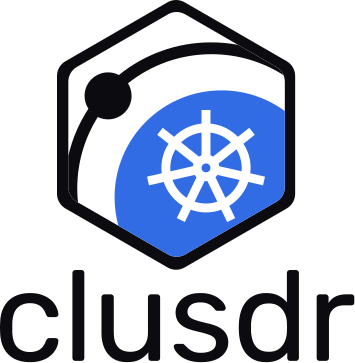

<h1 align="center">
  <a href="https://artifacthub.io/packages/helm/clusdr/clusdr">
    <picture>
      <source media="(prefers-color-scheme: dark)" srcset="k8s-lettermark-dark.svg">
      
    </picture>
  </a>
</h1>

<p align="center">DaemonSet topology. Join is still <code>clusdr join</code>.</p>

<p align="center">
  <a href="https://clusdr.io/docs/guide/kubernetes-helm"></a>
  <a href="https://artifacthub.io/packages/search?repo=clusdr"></a>
  <a href="https://github.com/clusdr/clusdr/blob/main/LICENSE"></a>
</p>

Example chart. **Not** an Operator, CRD, or sidecar injector.

One seed voter, a DaemonSet on every other node, `data.dir` on hostPath. Join is still [`clusdr join`](https://clusdr.io/docs/reference/cli/join). Sidecar StatefulSet is **not** this chart — see [sidecar](https://clusdr.io/docs/guide/kubernetes-sidecar).

Published on each `v*` tag as OCI (not `ghcr.io/clusdr/clusdr` — that is the daemon image). GitHub Release has the `.tgz`. Catalog: [Artifact Hub](https://artifacthub.io/packages/helm/clusdr/clusdr). There is no `helm repo add`. Values are validated by `values.schema.json`. The OCI digest is Cosign-signed on publish.

```bash
helm install clusdr oci://ghcr.io/clusdr/charts/clusdr --version 0.2.0 \
  --namespace clusdr --create-namespace \
  --set seed.nodeName=<node>
```

From a git checkout: `helm install clusdr charts/clusdr --namespace clusdr --create-namespace --set seed.nodeName=<node>`.

Copy the join token from the init hook logs, then join DaemonSet pods as **voters** until `voterCount` (default 3; seed is already 1). Extra nodes: `join --observer`. NOTES prints the loop.

```bash
helm install clusdr charts/clusdr --namespace clusdr --create-namespace --dry-run
helm template clusdr charts/clusdr --namespace clusdr --set voterCount=4   # fails: must be odd
```

| Value | Meaning |
|---|---|
| `image.repository` | Published `durguto/clusdr` |
| `image.tag` | Empty uses `appVersion` (the daemon tag). Override to pin |
| `dataDir` | hostPath on the node (`/var/lib/clusdr`). Prepare DaemonSet chowns uid 65532 |
| `prepare.image` | busybox (daemon image has no shell) |
| `voterCount` | Odd target. Helm does not join |
| `seed.nodeName` | Same node for init Job and seed Deployment |
| `probes.type` | `exec` (`clusdr health`) or `tcp` (7947) |

Hooks: the init Job is `pre-install,pre-upgrade` so the seed does not start on an empty disk. It does **not** run on DaemonSet pods and does **not** `--bootstrap` every ordinal. `clusdr init` is success when identity already exists.

Scaling a workload Deployment does not add Raft members. Restart with intact `dataDir` is `clusdr start`, not another `join`.

This chart does not install CRDs. Automatic join is the [Operator](https://clusdr.io/docs/guide/kubernetes-operator) (`https://clusdr.io/download/clusdr-operator-bundle.yaml`), not `helm install`. Sidecar is a CR or YAML, not this chart. Cordon, drain, and PreStop are reboot, not `leave`.
